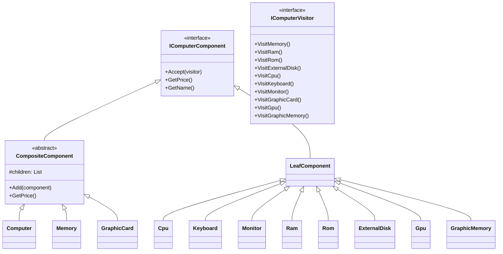

# Computer Architecture Price Calculator

## Problem Statement
Design and implement a program that models a computer architecture using Composite and Visitor design patterns. The computer consists of various components:

### Component Structure
- Computer
  - CPU
  - KEYBOARD
  - MEMORY
    - RAM
    - ROM
    - EXTERNAL DISK
  - MONITOR
  - GRAPHIC CARD
    - GPU
    - GRAPHIC MEMORY

### Requirements
1. Use composite pattern to model the computer architecture
2. Implement visitor pattern to calculate the price of memory components only (RAM, ROM, EXTERNAL DISK)
3. Other component prices can be ignored in the final calculation

### Test Data (Prices in AED)
- KEYBOARD: 60
- CPU: 400
- MONITOR: 120
- GPU: 200
- GRAPHIC MEMORY: 100
- RAM: 140
- ROM: 90
- EXTERNAL DISK: 150

## Solution Architecture



## Implementation Details

### Design Patterns Used
1. **Composite Pattern**
   - Allows treating individual components and composite components uniformly
   - Implements tree structure for computer components
   - Components share common interface `IComputerComponent`

2. **Visitor Pattern**
   - Separates algorithms from object structure
   - `MemoryPriceVisitor` calculates prices of memory components
   - Allows adding new operations without modifying component classes

### Key Components
- `IComputerComponent`: Base interface for all components
- `CompositeComponent`: Abstract class for components that can contain other components
- `LeafComponent`: Base class for atomic components
- `IComputerVisitor`: Interface for visitor pattern implementation
- `MemoryPriceVisitor`: Concrete visitor that calculates memory prices

### Output
The program displays:
```
Computer Architecture Price Calculator
=====================================
Memory Components Prices:
------------------------
RAM: 140 AED
ROM: 90 AED
External Disk: 150 AED

Total price of memory components: 380 AED
```

## How to Run
1. Clone the repository
2. Open the solution in Visual Studio or JetBrains Rider
3. Build and run the project

## Requirements
- .NET 9.0 or later
- C# development environment (Visual Studio/Rider)
